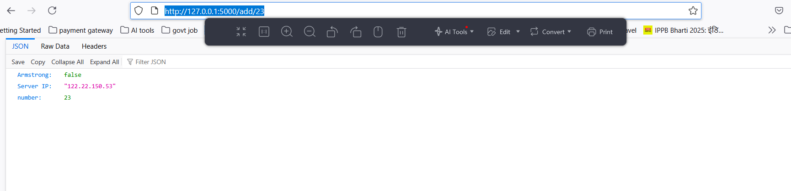

#### In this project we create a simple project to send the return in json format 

for that we use the jsonify from flask

# Jsonify 
In Flask, jsonify is a function that simplifies the creation of JSON responses. It takes Python objects, typically dictionaries or lists, and converts them into JSON format, setting the correct Content-Type header for the response. This makes it easy to return data in JSON format, which is commonly used in REST APIs. 

### Here's a more detailed breakdown:
#### Key Features:
##### JSON Conversion:
jsonify automatically handles the serialization of Python objects into JSON strings.

##### Content-Type Header:
It sets the Content-Type header to application/json, indicating that the response contains JSON data.

##### Flask Response Object:
It returns a Flask Response object, which can be directly returned to the user.
##### Simplified API Development:
It streamlines the process of returning data in JSON format, which is a common requirement for REST APIs. 
### How it Works:
**Input:** You pass one or more Python objects (like dictionaries or lists) to the jsonify function.

**Serialization:** jsonify uses the json.dumps() function to convert these objects into a JSON string.

**Header Setting:** It sets the Content-Type header to application/json.

**Response Object:** It creates a Flask Response object with the JSON data as the content and the header.

**Return:** The Response object is returned, ready to be sent back to the client. 

